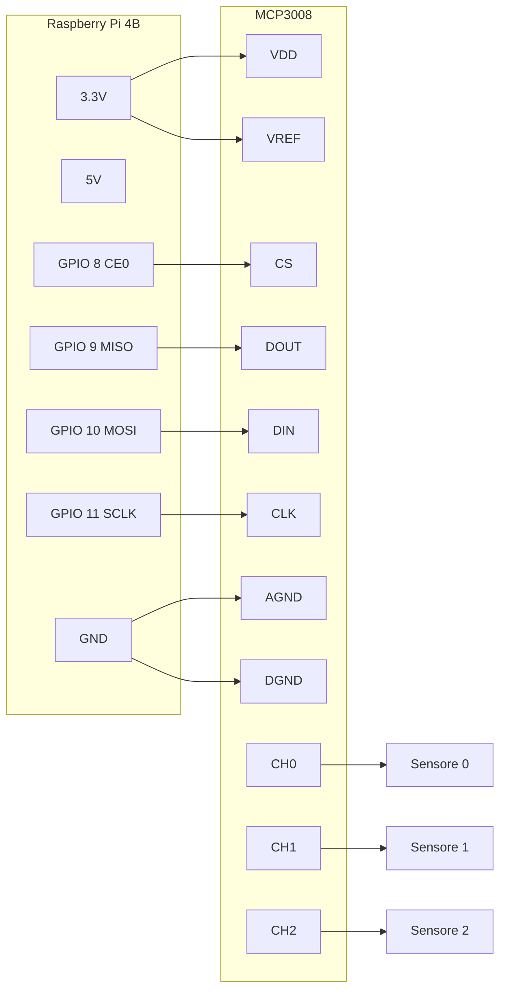

```mermaid
graph LR
    subgraph Raspberry Pi 4B
        PIN3V3[3.3V]
        PIN5V[5V]
        PIN8[GPIO 8 CE0]
        PIN9[GPIO 9 MISO]
        PIN10[GPIO 10 MOSI]
        PIN11[GPIO 11 SCLK]
        PINGND[GND]
    end
    subgraph MCP3008
        VDD[VDD]
        VREF[VREF]
        AGND[AGND]
        CLK[CLK]
        DOUT[DOUT]
        DIN[DIN]
        CS[CS]
        DGND[DGND]
        CH0[CH0]
        CH1[CH1]
        CH2[CH2]
    end
    PIN3V3 --> VDD
    PIN3V3 --> VREF
    PINGND --> AGND
    PINGND --> DGND
    PIN11 --> CLK
    PIN9 --> DOUT
    PIN10 --> DIN
    PIN8 --> CS
    CH0 --> SENSOR0[Sensore 0]
    CH1 --> SENSOR1[Sensore 1]
    CH2 --> SENSOR2[Sensore 2]
```